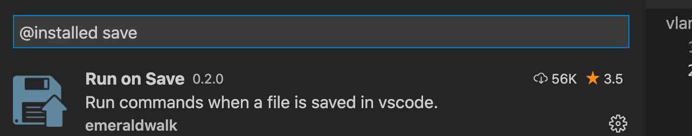

# how to enable autosaves

make sure Run On Save extension is enabled



in your workspace settings file,


you have following json

```json
{
	"folders": [
		{
			"path": "."
		}
	],
	"settings": {
		"v.vls.enable": true,
		"emeraldwalk.runonsave": {
			"commands": [
				{
					"match": "\\.v$",
					"isAsync": true,
					"cmd": "v fmt -w ${file}",
					"runIn": "terminal"
				},
				// {
				// 	"match": ".*",
				// 	"cmd": "echo 'I am ${env.USERNAME}.'",
				// 	"runIn": "terminal"
				// }
			]
		},
	},
	"tasks": {
		"version": "2.0.0",
		"tasks": [
			{
        //not really needed is just example of how task can be defined
				"label": "format",
				"type": "shell",
				"command": "v fmt -w ${file}",
			}
		]
	}
}
```

example is in this repository


