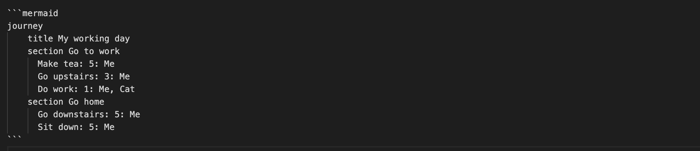
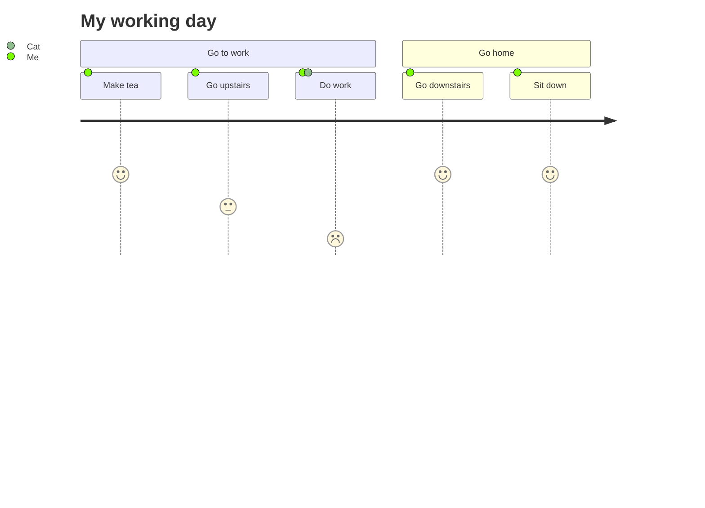
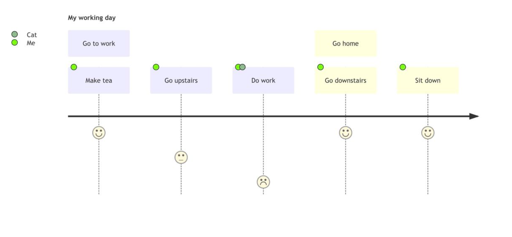

# Mermaid

Instructions see https://mermaid-js.github.io/mermaid/#/

just put the mermaid code in `mermaid` block

### example:

```mermaid
journey
    title My working day
    section Go to work
      Make tea: 5: Me
      Go upstairs: 3: Me
      Do work: 1: Me, Cat
    section Go home
      Go downstairs: 5: Me
      Sit down: 5: Me
```

this results in the following

