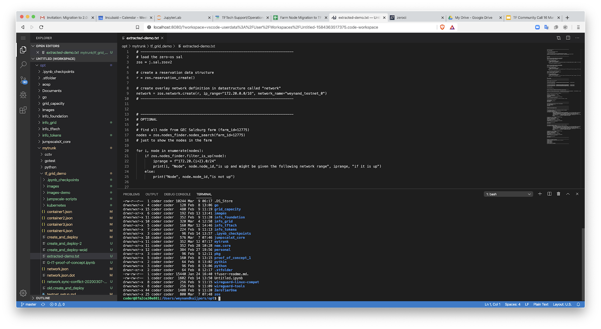

# Hercules Coder

## What

Hercules Coder presents an online coding environment which is accessible from any device that is able to run a web browser.  This coding environment runs in your 3bot and provides you with a save, private and secure environment to do your coding work.  It allows you to connect and store/retrieve code from any public open source and commercial code repositories supporting the git protocol.

The coding environment includes:

*   A web based editor (see [https://code.visualstudio.com/](https://code.visualstudio.com/), MIT open source license)
*   An auto testing environment made available to the developer by the 3bot this is called  ZeroCI
*   A decentralized code version control system that can be installed on the 3bot (git based)

Basically everything required to run a full blown development environment in a peer2peer way.

## Features

*   Runs anywhere in the world on the ThreeFold grid.
*   Provides a secure and private connection to the development environment from anywhere, any device that supports the https protocol.
*   Uses the git protocol to clone, push and pull coding in and out of the development environment.,

## Architecture

The system is a pure development environment allowing the developer to create, store and test code in one environment.  This is done in a secure way by having all the required software run securely in a 3bot on the TF Grid.

The 3bot is a general-purpose compute and storage entity in which you can run different applications.  The code server software package runs as a web service in your 3bot and presents secure interfaces (web browser, encrypted and secured traffic).

As a developer, you have numerous options to user as a trusted code base storage providers, as long as it supports the git protocol to manage content.

*   Public and private hub like GitHub 

## Main Benefits 

*   Secure web access to code editor and server
*   Secure decentralised storage of created code
*   Secure test environment to auto test the created code..
*   No central components involved anywhere in this setup
*   Enhanced co-editing capabilities and online collaboration
*   Peer2Peer git based system.
*   Integration with decentralized filesystems like ipfs

## Roadmap

### v1.0: Q4 2020

We can already demonstrate all features, but will go life in production end 2020.
