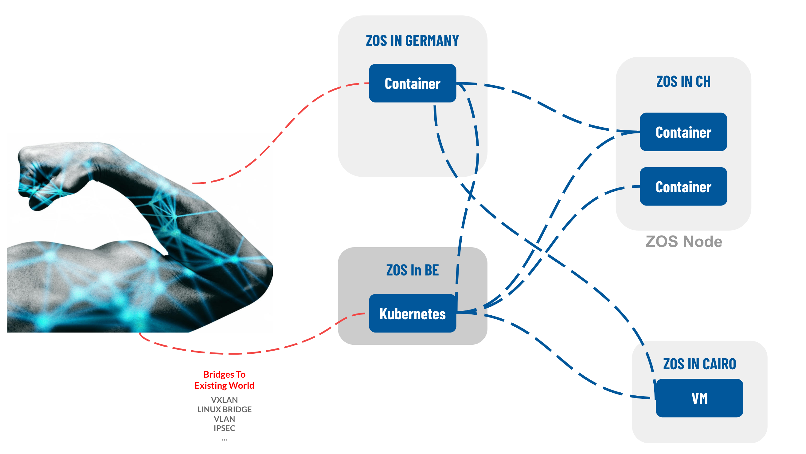

# Enterprise Connectivity (OEM)

For enterprise use cases we allow zero-os’es to be connected to any locally deployed networks. 

The network module on Zero-OS facilitates for all over the described features and functionality in the section above but we do understand that there is a lot of existing secure networking architectures and standards in use.  We embrace those existing standards in OEM use cases and can enhance the networking module to embrace and use these existing secure networking structures.

Supported technologies:

*   VXLan
*   IPSec
*   VLAN
*   Direct Network bridges
*   … any other chosen network technology can easily be integrated

### OEM ideas (custom development for larger projects):

*   For enterprise use cases we can support NetFlow functionality creating monitoring capabilities for all network traffic. 
*   Custom admin interfaces can be created for enterprise use-cases.