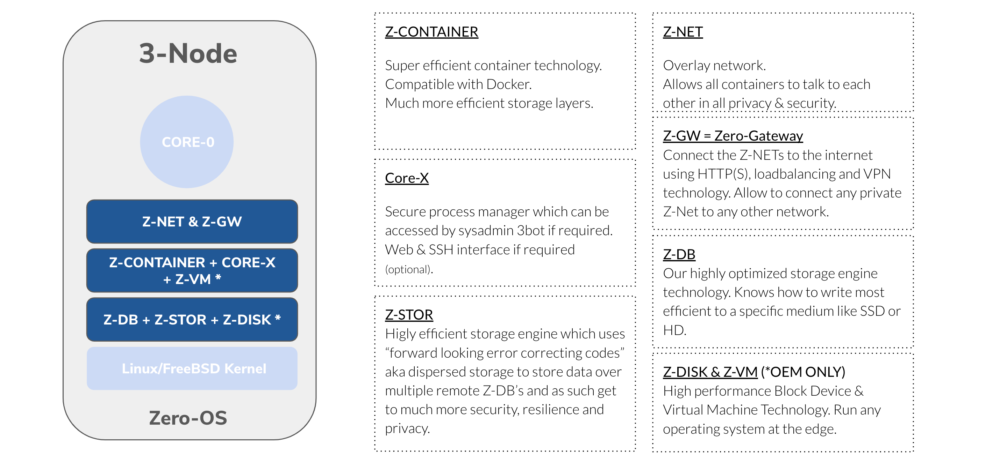
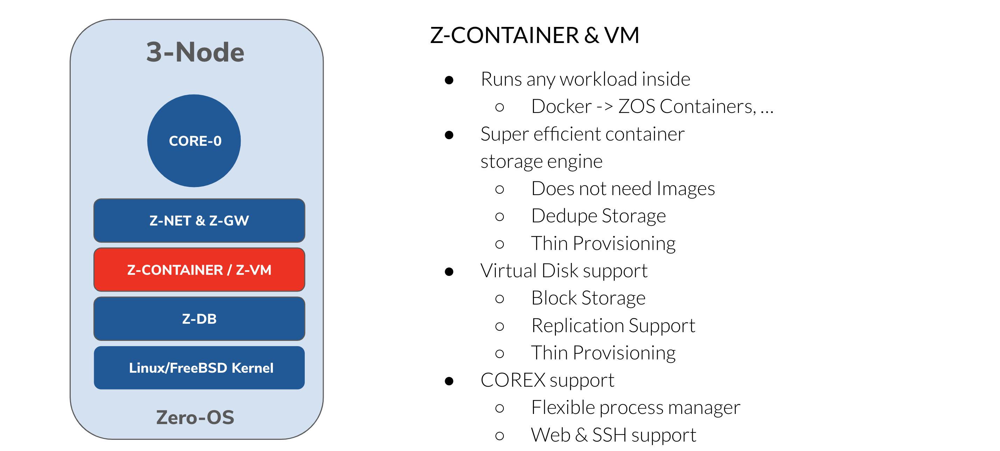

# ZeroOS

ThreeFold has created an operating system from scratch, we used the Linux kernel and its components and then build further on it, we have been able to achieve all above benefits.

ZeroOS (ZOS) is an operating system designed to be as secure as possible and super close to the hardware.

### Benefits

- no install required
- all files are deduped for the VM's, containers and the ZOS itself, no more data duplicated filesystems
- the hacking footprint is super small, which leads to much more safe systems
    - every file is fingerprinted and gets checked at launch time of an application
    - there is no shell or server interface on the operating system
    - the networks are end2end encrypted between all Nodes
- there is the possibility to completely disconnect the compute/storage from the network service part which means hackers have a lot less chance to get to the data.
- a smart contract for IT layer allows groups of people to deploy IT workloads with concensus and full control
- all workloads which can run on linux can run on Zero-OS but in a much more controlled, private and safe way

## The requirements for our Zero OS are:

- **Autonomy**: TF Grid needs to create compute, storage and networking capacity everywhere. We could not rely on a remote (or a local) maintenance of the operating system by owners or operating system administrators.
- **Simplicity**: An operating system should be simple, able to exist anywhere, for anyone, good for the planet.
- **Stateless**. In a grid (peer-to-peer) set up, the sum of the components is providing a stable basis for single elements to fail and not bring the whole system down. Therefore, it is necessary for single elements to be stateless, and the state needs to be stored within the grid.

## architecture

The core-0 is the master process which manages everything which comes later.

- Zero-DB = the base storage component on top of SSD/HD provides efficient storage access
- Zero-Net = meshed overlay network layer, delivers secure global scalable network between the containers and VM's
- Process management and remove access.

### Zero install

The Zero-OS is delivered to the 3Nodes over the internet network (network boot) and does not need to be installed.

### 3Node Install

1. Acquire a computer (server).
2. Configure a farm on the TFGrid explorer.
3. Download the bootloader and put on a USB stick or configure a network boot device.
4. Power on the computer and connect to the internet.
5. Boot! The computer will automatically download the components of the operating system (Zero-OS).

The actual bootloader is very small. It brings up the network interface of your computer and queries TFGeid for the remainder of the boot files needed. 

The operating system is not installed on any local storage medium (hard disk, ssd). Zero-OS is stateless.

The mechanism to allow this to work in a safe and efficient manner is a ThreeFold innovation called our container virtual filesystem. This is explained in more detail [here](architecture_flist.md)

### Properties of Zero-OS

Zero-OS is a very lightweight and efficient operating system. It supports a small number of _primitives_; the low-level functions it could perform natively in the operating system. 

There is no shell, local nor remote. 

It does not allow for inbound network connections to happen. 

If you are technical, you can learn more on our github repository: [Zero-OS](https://github.com/Threefoldtech/zos/tree/master/docs).

