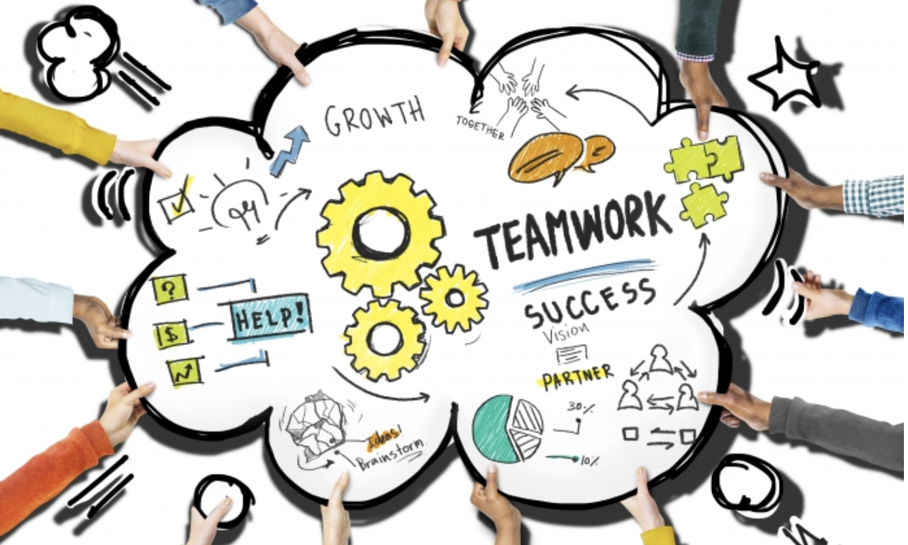

# Circle Based (Peer2Peer) Collaboration

We believe in "self-healing organizations" where circles (teams organized around topics) collaborate with each other. It's similar to how our own human body works. For instance: lungs provide oxygen but they need red-blood cells to move the oxygen to the rest of the body; the brain can tell us where to drive, but it needs hands and feet to operate the car.

Organizations like this give a lot of independence to their contributors. However, the organizations can only succeed if contributors know what is expected of them and are willing to follow a set of mutually agreed principles to ensure harmonious and effective working together. Of course not every contributor is the same.

Information flow and discipline is very important in such an organization.

### Requirements

- I am a true [freeflow citizen](freeflow_citizen) and believe in the values.
- I understand [stars vs spheres](stars_vs_spheres) and want to work in an organization which does not rely on classic mgmt structures.
- I understand and am willing to work following: [peer 2 peer, awareness level, how easy is it for you to operate from circles](p2p_awareness_level)
- I understand [agile working principles](agileprinciples) and see the value in it.

### Each circle has different levels of contributors

- See [circles_roles](circles_roles.md)

### Practical Requirements

You are willing to:

- Learn our adopted agile methodology (circles, stories...) and get fluent with it. It's a lot easier than you think! We will be creating some videos about this soon.
    - [Story cards](stories.md)
    - [Circles roles](circles_roles.md)
- Learn how to create/use [story cards](stories.md) (it's an art by itself)
    - Report on the work done in the stories and always help to keep the stories up to date
- Feel comfortable being 100% open to everyone about anything
- Not try to be perfect, 20% effort gets any goal to 80% of requirements. It does not pay off to try to be perfect.
- Keep all your work open, when you start working on something make sure everyone else can follow the process, 
    - Don't first create and then contribute, it's much better to have your work accessible while you improve 
      (e.g. a google document, or multiple iterations of markdown documents).
- Deliver work which is good enough
    - Not perfect (see above) but good enough to achieve the requirements as mentioned in a story card.
- Give feedback to others and escalate when required (in a loving way)
- Respect the contribution of others, improve where possible, if the contribution is not good enough please go back to the author, discuss and try to help.

### Remunerations

- see [circles_remuneration](circles_remuneration.md)
