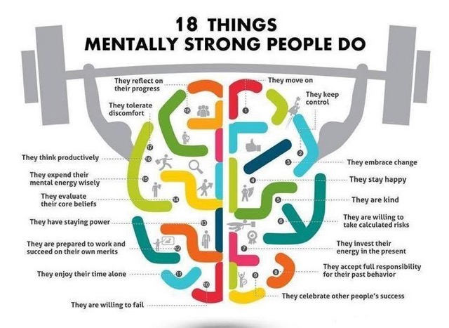

# Intro

Building startups is not easy and finding the right mix of people very challenging.

There are many models on the internet around profiling people, but most of them we find way too complex e.g around Quotients some models use up to 9 different types which I believe is too complex.

This document is our attempt to simplify lots of information we found on the internet and bring some new structure to it.

We believe we only need 3 Quotients and can add everything else underneath.
We also believe that we can link these Quotients to different parts of our mind (see last paragraph), we have done quite some work around the role of these minds, in the future we are planning to also publish this information. 

We believe that any person working for a startup needs to have a minimal skill level in the 3 main Quotients as defined below.
If not then this person will not be very effective and potentially even damage the culture & efficiency of a startup.

# 3 Main Quotients

In our world IQ has become way too important. While the other 2 are at least as important.

## IQ (Intellectual Quotient)

IQ leads us to think, make cause-effect analysis, doing math, describe something' and create our level of understanding. But many people just concentrate in this holy shit thing! Because I thought before, this is our future, what we learn at school, 8 hours per day, 6 days a week for 16 years in elementary school, junior high school, senior high school, and college.

People with high IQ Exhibits the following Characteristics.

* Logical and analytical ability
* Inquisitiveness
* Problem-solving skills
* Interest in reading and using language effectively
* Extraordinary memory with numbers and words.
* Perfectionism
* Long attention span.

### PQ (Physical Quotient) = the physical part of IQ

PQ is our body of course! We should count it on, coz' our body, my body is beautiful. Hohoho.. It has authority for a living. My brain executes the heart to beat, lungs to suck the air, self-healing, laughing, sneezing, and also fart! pufff... It's amazing. Isn't it?

Physical Quotient (PQ) indicates the capacity to work through situations through your physical proves. That means effective and efficient use of your hand eyes coordination. Kind of skill and flawless fluidity demonstrated by sportsmen, warriors, fighters, performers, athletes, dancers etc.

Its intelligence of the body.

## EQ (Emotional Quotient )

EQ is knowledge about knowing our self, sensitivity to feel change in our environment and also to estimate time, empathy, communication skill (I called it communication with voice and also with gesture, either with heart), courageous to confess our mistakes, respect diversity, etc. Who is a successful leader should develop these more than others! but keep your life in balance!

* People with high EQ exhibit and express their feelings clearly and directly.
* They are not dominated by negative emotions such as fear, worry, guild, shame, embarrassment, obligation, disappointment and hopelessness.
* They are able to read non-verbal communication.
* They balance feelings with reason, logic and reality.
* They are independent, self reliant and morally autonomous who can work and thirve with interdependence very effectively.
* They are internally self-motivated.
* They are not motivated by power, wealth, but are more influenced by fame, relationship and approval by others.
* They are always people and group smart who work well in groups, teams and best in making relationships and maintaining them.
* They are emotionally expressive yet resilient.

### AQ = Associative thinking as a result of EQ

Associative thinking underlies most of our purely emotional intelligence (EQ) - the link between one emotion and another, between emotions and bodily feelings, emotions and the environment. It is also able to recognise patterns like faces or smells, and to learn bodily skills like riding a bicycle or driving a car. It is 'thinking' with the heart and the body and so is thought of as our 'emotional intelligence' or the 'body's intelligence'. The structures within the brain with which we do our associative thinking are known as neural networks. Each of these networks contains bundles of up to 100,000 neurons, and each neuron in a bundle may be connected to as many as 1,000 others. Unlike the precise wiring of neural tracts, in neural networks each neuron acts upon or is acted upon by, many others simultaneously.

Unlike serial neural tracts which are rule bound or program-bound and thus unable to learn, neural networks have the ability to rewire themselves in dialogue with experience. All associative learning is done by trial and error. This kind of learning is experience-based: the more times I perform a skill successfully, the more inclined I will be to do it that way next time. Associative learning is also tacit learning - I learn the skill, but I can't articulate any rules by which I learned it and usually can't even describe how I did so. Neural networks are not connected with our language faculty, nor with our ability to articulate concepts. They are simply embedded in experience. We feel our skills, we do our skills, but we don't think or talk about them. We develop our skills because they give us a sense of satisfaction or a feeling of reward, or because they help us avoid pain.

Thus most emotions are developed by **trial-and-error**, a slow associative build-up of response to certain stimuli. and they are quite habit-bound. Once I have learned to feel anger at a given stimulus, it is difficult for me to react differently next time. Much of psychotherapy exists to help people break the habit of long-standing but inappropriate emotional association.

Like other aspects of associative intelligence, emotions are not immediately verbal. We often have trouble talking about them, at least with any accuracy, and they are certainly not always 'rational' in the sense of obeying rules or predictions. They often respond to incomplete data in unpredictable ways.

Associative intelligence is able to deal with ambiguous situations, but it is also 'approximate'. It is more flexible but less accurate than serial thinking. The disadvantages of this type of thinking are that it is slowly learned, inaccurate and tends to be habit-bound or tradition bound. We can relearn a skill or an emotional response, but it takes time and much effort. And because associative thinking is tacit, we often have difficulty sharing it with others. We can't just write out a formula and tell someone else to get on with the job. All of us must learn a skill in our own way, for ourselves. No two brains have the same set of neural connections.

## SQ (Spiritual Intelligence)

Spiritual intelligence (SQ) could also be called the 'intelligence of meaning'. It is what makes us essentially human: the ability to plan, to make sense of our emotions, to control our impulses, to make choices, and endow our world with meaning. 

It's helping us to stack our principles, values, and connect our soul with our beliefs, our purposes in life. Just this quotient when can claim that we are the most valuable creatures on earth

Spiritual Intelligence (SQ), expands the horizon of human Ego. It expands and harmonizes the horizon of human awareness and influence to the largest possible dimensions which are all inclusive.  

Whereas IQ is rule based, EQ helps us act appropriately within society's prescribed boundaries, SQ helps us extend and change the boundaries, question our assumptions and formulate new meaning. 

SQ is the intelligence of **creativity**. It is linked with creating order (less entropy) in the brain from chaos (high entropy). Bringing about new order in our brain is facilitated by engaging in activities related to our least conscious part of the brain (our creative mode) in a playful, non-dutiful fashion. "SQ is our compass 'at the edge' " 

People with high SQ exhibit the following characteristics:

* Flexibility
* Tolerance
* Self-awareness
* Broad inclusive approach.
* The ability to go through all challenges with poise and equanimity.
* The ability to understand both human, social as well as natural situations easily and able to handle them well.
* The ability to inspire by a vision.
* An ability to see connections between diverse things and see all holistically and holistically.
* A desire and capacity to cause as little harm as possible and promote well-being harmony for all.
* A tendency to probe and ask fundamental questions about everything.
* An ability to go against conventions.

### CQ (Creativity Quotient) result of SQ

Creativity Quotient is the ability to generate innovative ideas and manifest them from thought into reality. The process involves original thinking and then producing. 

It's very closely linked to SQ !

* People with creativity are fluent thinkers, able to generate possibilities, consequences, or relate ideas.
* They are flexible thinkers, and use many different alternatives and approaches to problem solving.
* They are original as thinkers, seeking new, unusual or unconventional associations and combinations among items of information.
* They often display intellectual playfulness and like to fantasize and imagine.
* They are sensitive to beauty and are attracted  to aesthetic values.
* They are versatile in use of their multiple senses and harmonize them into unique synthesis and solutions.

# Link with different parts of the mind

## IQ = ratio (the 5% of our mind reasoning)

- everything we need our thinking mind for (our ratio) is linked to IQ/PQ

## EQ = Our Subconsciousness (our 95% of mind doing all the hard work)

- So much more important but largely forgotten in our education
- This is everything which we cannot do with ratio
    - Emotions
        - e.g. will, passion to get something done
    - The use of our senses (all of our senses) like feelings
    - Making new connections in our brain, associations, and coming up with new solutions thanks to using 95% of our mind.

## SQ = Collective Subconsciousness (what connects us all)

- The mainly forgetting part in our education and yet maybe even the most important part required to be most effective in whatever your goals might be.
- For me personally it all boils down to: do more with less effort (trust, intuition, beliefs, ...)

# Mentally Strong People

# Sources

- http://jobs.ucdc.co.in/getpagedata.php?pageid=NDM%3D
- https://www.minessence.net/articles/iq_eq_sq-differences.aspx