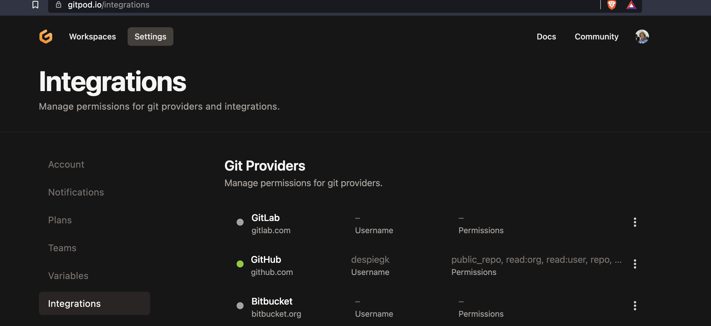
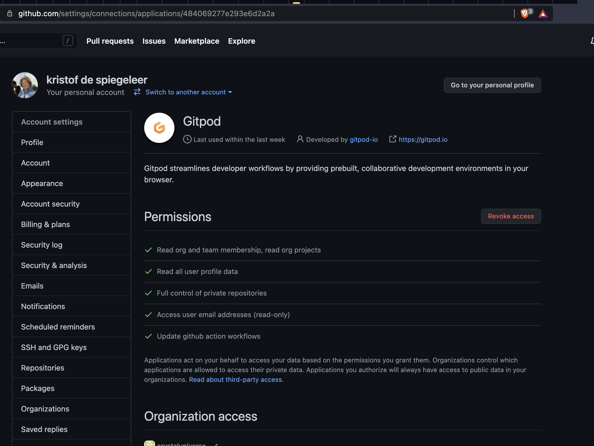

# GITPOD

> TODO more info needed

### install gitpod extension in your browser

- go to https://chrome.google.com/webstore/detail/gitpod-dev-environments-i/dodmmooeoklaejobgleioelladacbeki?hl=en
- login to gitpod
- authorize github

### see more here

- [gitpod_detail](gitpod_detail)