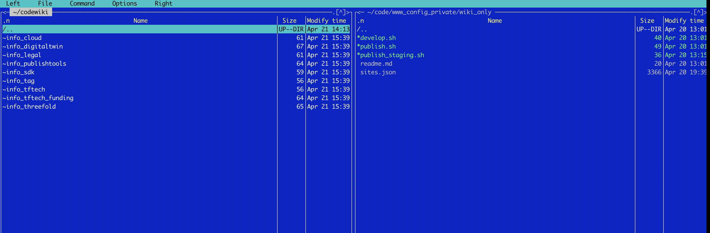

# Code Wiki Tricks



See how in a dir right there is a sites.json

This file has all required info to get the content & be able to do publish, develop, ... see [sites.json](sites_json).

When using the

```
cd /the/directory/of/sites_config
publishtools develop
```

this will create the directory structure at the left

if you know go to this directory and do

```bash
code .
```

it will open visual studio code 


Here you now have all directories together for editing purposes.

This allows easy search & replace.

