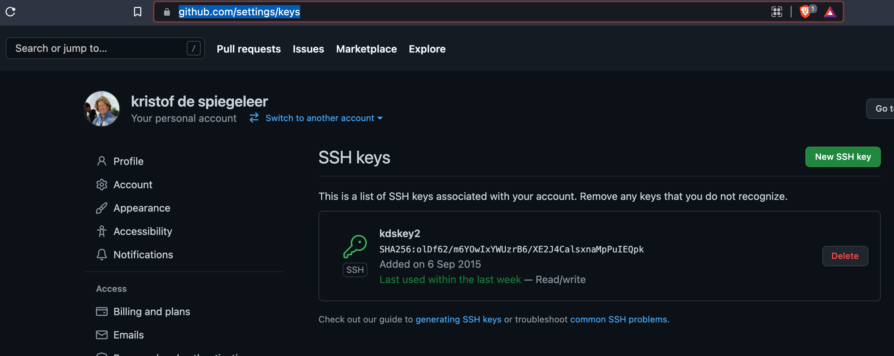

## Add SSHKey to GITHUB

Add your key to https://github.com/settings/keys

see screen what needs to be done, basically just upload your ssh generated public key

### You should see the following result

If you use the ffutils tool, please confirm you succeeded.

