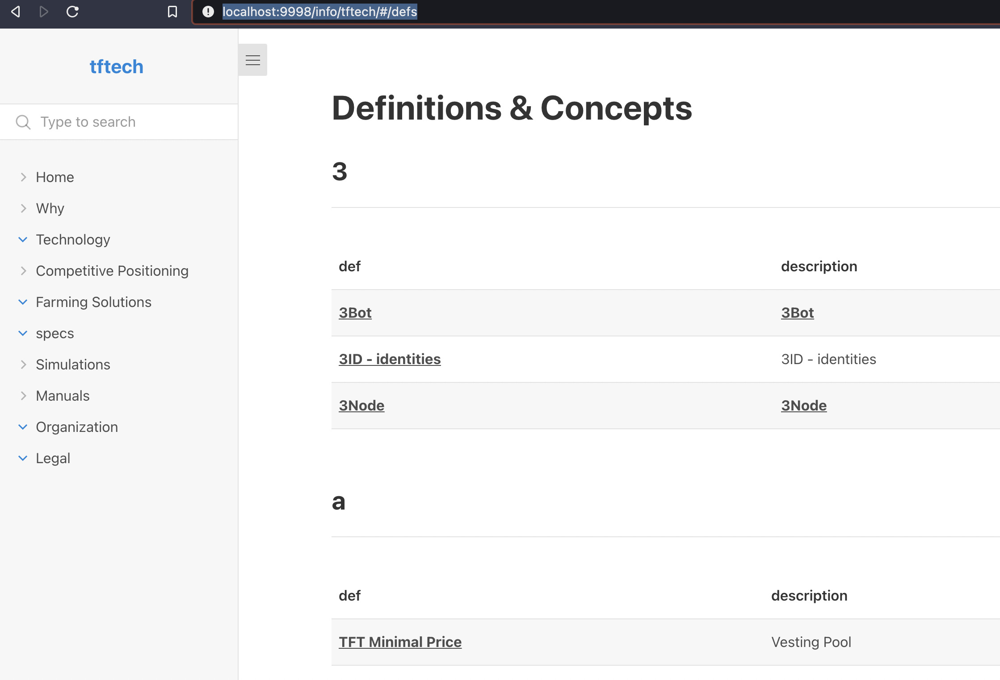

# defs list

show a list of definitions

```python
#replace ! with !!!

!def_list categories:'' exclude:'tech'

``` 

- categories: specify list of one or more categories to show
- exclude: list of categories not to show

the result looks as:

